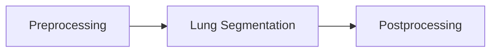

# Lung segmentation in 3D computed tomography scans

In this tutorial it is explained how to segment a lung in a a 3d CT scan. First let's take a look at a CT scan.

	

In the picture above you can vaguely outline the body, head and arms of the person. Below the person a table, on which the person is lying, can be spotted. It is worth mentioning that the table is not broken and the gaps are due to the displaying technique used. Now lets take a look at a axial slice in the center.

	

In this image the lung is displayed in dark. The surrounding tissues and bones appear brighter. The background is rouhly the same intensity as the lung tissue. In the bottom of the picture multiple lines can be seen. These lines are the edges of the patient table and what appears to be a cushion. The goal of the lung segmentation is to find/segment the lung. In order to do accomplish this the table, background and surrounding tissues need to be removed. The flow diagramm below shows the workflow. In the following all steps will be explained in detail with text, pictures and code.

## Preprocessing
The first step is the preprocessing. The goal is to remove the table and make the background the same intensity as the tissue surrounding the lung. Each pixel/vocel in a computed tomography scan is not encoded in a range from 0-255 (8-bit unsigned), but rather in a range from −32,768 to 32,767 (16-bit signed). However, there is more to it. Each value represents a Hounsfield unit (HU) and Hounsfield units can be attributed to a specific tissue. Because we are only interested in lung tissue, we choose a range in which the lung is safely included and set all other pixels to the maximum of the range. In this case a range of -1000 HU to -500 HU.

<table style="width: 100%;">
  <tr>
    <th style="width: 40%;">Input</th>
    <th style="width: 40%;">Output</th>
    <th style="width: 20%;">Implementation</th>
  </tr>
  <tr>
    <td style="width: 33.33%;"></td>
    <td style="width: 33.33%;">
    <td style="width: 33.33%;">
      <pre lang="python"><code style="font-size: 18px;">
def clipScanToHounsfieldUnitRange(scan,HounsfieldUnitRange):
	HU_min = HounsfieldUnitRange[0]
	HU_max = HounsfieldUnitRange[1]
	return np.clip(scan,a_min=HU_min, a_max=HU_max) 
      </code></pre>
    </td>
  </tr>
</table>

This is done for the entire scan. The steps after this are applied to each slice seperately. It can be seen that the table in this viewing direction is not a straight line. This will become important later. To make the table straight, we use the sagittal view and therefore use sagittal slices. 
1. First we loop through the sagittal slices:
<table style="width: 100%;">
  <tr>
    <th style="width: 50%;">Sagittal slice</th>
    <th style="width: 50%;">Implementation</th>
  </tr>
  <tr>
    <td style="width: 50%;"></td>
    <td style="width: 50%;">
      <pre lang="python"><code>
def createMaskForEachSliceOf(self, clippedScan):
	mask = np.zeros(clippedScan.shape, dtype="int16")
	numberOfSagittalSlices = clippedScan.shape[1]
		for i in range(0,numberOfSagittalSlices):
			sagittalSlice = clippedScan[:,:,i]
			sliceMask = self.createMaskFrom(sagittalSlice)
			mask[:,:,i] = sliceMask.astype("int16")
	return mask
      </code></pre>
    </td>
  </tr>
</table>

2. The next step is to create a mask for each sagittal slice. Each function will be explained used will be explained in the following steps.
<pre lang="python"><code>
def createMaskFrom(self,SagittalSlice):
        denoisedSagittalSlice = cv2.medianBlur(SagittalSlice,ksize=5)
        binarizedSagittalSlice = self.binarize(denoisedSagittalSlice)
        sliceWithOpenTable = self.openTableOf(binarizedSagittalSlice)
        SagittalSliceWithUniformBackground, backgroundMask = self.createUniformBackgroundOf(binarizedSagittalSlice)
        mask = self.createMaskByFillingHolesOf(SagittalSliceWithUniformBackground)
        combinedMask = self.combineMasks(mask, backgroundMask)
        return combinedMask
</code></pre>

3. Let's start with the denoising. It is worth noting that denoising might remove relevant medical information.However, some scans can be a  bit noisy. The type of the noise seems to be "salt" and "pepper" noise. To reduce this kind of noise, one can apply median filtering. Let's zoom in on our slice and apply denoising. To the left you can see the background with some clothes, in the middle the tissues surrounding the lung and on the right the lung. You can see that the noise has been reduced, but at the same time the slice appears to be more blurry.
<table style="width: 100%;">
  <tr>
    <th style="width: 50%;">Clipped Sagittal Slice</th>
    <th style="width: 50%;">Denoised Sagittal Slice</th>
  </tr>
  <tr>
    <td style="width: 50%;"></td>
    <td style="width: 50%;"></td>
  </tr>
</table>

4. In order to create the mask we have to binarize the image. The binarization is achieved by thresholding the image with a threshold of the maximum value minus one.

<table style="width: 100%;">
  <tr>
    <th style="width: 40%;">Input</th>
    <th style="width: 40%;">Output</th>
    <th style="width: 20%;">Implementation</th>
  </tr>
  <tr>
    <td style="width: 33.33%;"></td>
    <td style="width: 33.33%;">
    <td style="width: 33.33%;">
      <pre lang="python"><code> 
def binarize(sagittalSlice):
	_, binarizedSlice = cv2.threshold(sagittalSlice,
	    	thresh=sagittalSlice.max()-1, maxval=1,
	    	type=cv2.THRESH_BINARY)
	return binarizedSlice.astype("uint8")
      </code></pre>
    </td>
  </tr>
</table>
