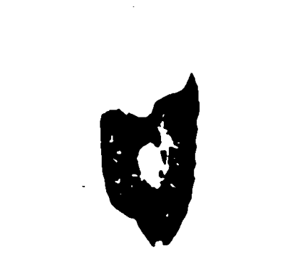

# Lung segmentation in 3D computed tomography scans

In this tutorial it is explained how to segment a lung in a a 3d CT scan. First let's take a look at a CT scan.

	

In the picture above you can vaguely outline the body, head and arms of the person. Below the person a table, on which the person is lying, can be spotted. It is worth mentioning that the table is not broken and the gaps are due to the displaying technique used. Now lets take a look at a axial slice in the center.

	

In this image the lung is displayed in dark. The surrounding tissues and bones appear brighter. The background is rouhly the same intensity as the lung tissue. In the bottom of the picture multiple lines can be seen. These lines are the edges of the patient table and what appears to be a cushion. The goal of the lung segmentation is to find/segment the lung. In order to do accomplish this the table, background and surrounding tissues need to be removed. The flow diagramm below shows the workflow. In the following all steps will be explained in detail with text, pictures and code.

## Preprocessing
The first step is the preprocessing. The goal is to remove the table and make the background the same intensity as the tissue surrounding the lung. Each pixel/vocel in a computed tomography scan is not encoded in a range from 0-255 (8-bit unsigned), but rather in a range from −32,768 to 32,767 (16-bit signed). However, there is more to it. Each value represents a Hounsfield unit (HU) and Hounsfield units can be attributed to a specific tissue. Because we are only interested in lung tissue, we choose a range in which the lung is safely included and set all other pixels to the maximum of the range. In this case a range of -1000 HU to -500 HU.

<table style="width: 100%;">
  <tr>
    <th style="width: 40%;">Input</th>
    <th style="width: 40%;">Output</th>
    <th style="width: 20%;">Implementation</th>
  </tr>
  <tr>
    <td style="width: 33.33%;"></td>
    <td style="width: 33.33%;">
    <td style="width: 33.33%;">
      <pre lang="python"><code style="font-size: 18px;">
def clipScanToHounsfieldUnitRange(scan,HounsfieldUnitRange):
	HU_min = HounsfieldUnitRange[0]
	HU_max = HounsfieldUnitRange[1]
	return np.clip(scan,a_min=HU_min, a_max=HU_max) 
      </code></pre>
    </td>
  </tr>
</table>

This is done for the entire scan. The steps after this are applied to each slice seperately. It can be seen that the table in this viewing direction is not a straight line. This will become important later. To make the table straight, we use the sagittal view and therefore use sagittal slices. 
1. First we loop through the sagittal slices:
<table style="width: 100%;">
  <tr>
    <th style="width: 50%;">Sagittal slice</th>
    <th style="width: 50%;">Implementation</th>
  </tr>
  <tr>
    <td style="width: 50%;"></td>
    <td style="width: 50%;">
      <pre lang="python"><code>
def createMaskForEachSliceOf(self, clippedScan):
	mask = np.zeros(clippedScan.shape, dtype="int16")
	numberOfSagittalSlices = clippedScan.shape[1]
		for i in range(0,numberOfSagittalSlices):
			sagittalSlice = clippedScan[:,:,i]
			sliceMask = self.createMaskFrom(sagittalSlice)
			mask[:,:,i] = sliceMask.astype("int16")
	return mask
      </code></pre>
    </td>
  </tr>
</table>

2. The next step is to create a mask for each sagittal slice. Each function will be explained used will be explained in the following steps.
<pre lang="python"><code>
def createMaskFrom(self,SagittalSlice):
        denoisedSagittalSlice = cv2.medianBlur(SagittalSlice,ksize=5)
        binarizedSagittalSlice = self.binarize(denoisedSagittalSlice)
        sliceWithOpenTable = self.openTableOf(binarizedSagittalSlice)
        SagittalSliceWithUniformBackground, backgroundMask = self.createUniformBackgroundOf(binarizedSagittalSlice)
        mask = self.createMaskByFillingHolesOf(SagittalSliceWithUniformBackground)
        combinedMask = self.combineMasks(mask, backgroundMask)
        return combinedMask
</code></pre>

3. Let's start with the denoising. It is worth noting that denoising might remove relevant medical information.However, some scans can be a  bit noisy. The type of the noise seems to be "salt" and "pepper" noise. To reduce this kind of noise, one can apply median filtering. Let's zoom in on our slice and apply denoising. To the left you can see the background with some clothes, in the middle the tissues surrounding the lung and on the right the lung. You can see that the noise has been reduced, but at the same time the slice appears to be more blurry.
<table style="width: 100%;">
  <tr>
    <th style="width: 50%;">Clipped Sagittal Slice</th>
    <th style="width: 50%;">Denoised Sagittal Slice</th>
  </tr>
  <tr>
    <td style="width: 50%;"></td>
    <td style="width: 50%;"></td>
  </tr>
</table>

4. In order to create the mask we have to binarize the image. The binarization is achieved by thresholding the image with a threshold of the maximum value minus one.

<table style="width: 100%;">
  <tr>
    <th style="width: 40%;">Input</th>
    <th style="width: 40%;">Output</th>
    <th style="width: 20%;">Implementation</th>
  </tr>
  <tr>
    <td style="width: 33.33%;"></td>
    <td style="width: 33.33%;">
    <td style="width: 33.33%;">
      <pre lang="python"><code> 
def binarize(sagittalSlice):
	_, binarizedSlice = cv2.threshold(sagittalSlice,
	    	thresh=sagittalSlice.max()-1, maxval=1,
	    	type=cv2.THRESH_BINARY)
	return binarizedSlice.astype("uint8")
      </code></pre>
    </td>
  </tr>
</table>

5. Thex next goal is to make everything that is not lung tissue white. In order to accomplish this, we will flood the image from the left and right. We could also flood it from the top and bottom, but in case the lung is touching the border, it will flood it to0. However, a problem remains. When flooding from the right, it is impossible to flow through the table. So we need to break the table first. We do that on the top row of the image only. We use morphological opening to open the table. The structuring element is a line. The line needs to be longer than the table width. The result idea is displayed below.

<table style="width: 100%;">
  <tr>
    <th style="width: 40%;">Input</th>
    <th style="width: 40%;">Output</th>
    <th style="width: 20%;">Implementation</th>
  </tr>
  <tr>
    <td style="width: 33.33%;"></td>
    <td style="width: 33.33%;">
    <td style="width: 33.33%;">
      <pre lang="python"><code> 
def openTableOf(binarizedSagittalSlice):
  kernel = cv2.getStructuringElement(shape=cv2.MORPH_RECT, ksize=(25,1))
  topRowOpen = cv2.morphologyEx(binarizedSagittalSlice[:1], cv2.MORPH_OPEN, kernel, iterations=1)
  binarizedSagittalSlice[:1] = topRowOpen
  return binarizedSagittalSlice)
      </code></pre>
    </td>
  </tr>
</table>

6. Now we floodfill the binarized image from left and right. In addition to that, we will receive a mask of where the floodfilling was applied. We call this mask background mask. The floodfilling only accepts a single pixel as an input. Since we want to flood from the entire edge, we draw a line in the color of background there.
<table style="width: 100%;">
  <tr>
    <th style="width: 40%;">Input</th>
    <th style="width: 40%;">Output</th>
    <th style="width: 20%;">Implementation</th>
  </tr>
  <tr>
    <td style="width: 40%;"></td>
    <td style="width: 40%;">
    <td style="width: 20%;">
      <pre lang="python"><code> 
def createUniformBackgroundOf(binarizedSagittalSlice):
  h, w = binarizedSagittalSlice.shape[:2]
  backgroundMask = np.zeros((h+2,w+2),dtype="uint8")
  cv2.line(binarizedSagittalSlice, (0,0),(0,h-1),0,thickness=1) 
  cv2.line(binarizedSagittalSlice, (w-1,0),(w-1,h-1),0,thickness=1) 
  cv2.floodFill(binarizedSagittalSlice, backgroundMask, (0,0),1,flags=4) 
  cv2.floodFill(binarizedSagittalSlice, backgroundMask, (w-1,0),1,flags=4)
  backgroundMask = np.logical_not(backgroundMask[1:-1,1:-1]).astype("uint8") 
  return binarizedSagittalSlice, backgroundMask
      </code></pre>
    </td>
  </tr>
</table>

7. As you can see we now have the lung in black on a white background. The goal is to have the lung in white on a black background. Because, we will apply the mask to the original image again and refine it, we can close the holes now generously. This is done by applying a box filter of ones with a kernel size of 30. The output of this convolution will not be binary anymore. Therefore, the slice is thresholded again. As you can see the lung area is covered, but there are some points that clearly don't below to the lung.

<table style="width: 100%;">
  <tr>
    <th style="width: 50%;">Output</th>
    <th style="width: 50%;">Implementation</th>
  </tr>
  <tr>
    <td style="width: 50%;">
    <td style="width: 50%;">
      <pre lang="python"><code> 
def createMaskByFillingHolesOf(BinarySliceWithUniformBackground):
  inverted = (np.logical_not(BinarySliceWithUniformBackground)).astype("uint8")
  filled = cv2.boxFilter(inverted, ddepth=-1, ksize=(30,30), normalize=False)
  _, binarized = cv2.threshold(filled, thresh=1, maxval=1, type=cv2.THRESH_BINARY)
  return binarized
      </code></pre>
    </td>
  </tr>
</table>

8. The final step of the preprocessing is the combining of the masks. The creation of the mask in step 7. has caused the mask to grow back in the background. Luckily for us,  in step 6, we have created a background mask so we can just use this one. In the image below, one difference is circled.

<table style="width: 100%;">
  <tr>
    <th style="width: 50%;">Output</th>
    <th style="width: 50%;">Implementation</th>
  </tr>
  <tr>
    <td style="width: 50%;">
    <td style="width: 50%;">
      <pre lang="python"><code> 
def combineMasks(filledMask, backgroundMask):
  return cv2.bitwise_and(filledMask, backgroundMask)
      </code></pre>
    </td>
  </tr>
</table>

Now let's put everything together. First we clip the scan, than we create a mask slice-by-slice by applying the eight steps:

<pre lang="python"><code> 
def createCoarseLungMaskOf(self,scan):
  HounsfieldUnitRange = (-1000, -500)
  clippedScan = self.clipScanToHounsfieldUnitRange(scan, HounsfieldUnitRange)
  mask = self.createMaskForEachSliceOf(clippedScan)
  return mask
</code></pre>

As a reminder: The returned mask is a 3d numpy array. Additionally, all functions have been put in a class.

### Evaluation of preprocessing
The goals of the preprocessing were:
1. Remove the table
2. Make the backgroud and surrounding tissue of the lung the same color
   
Let's check if the table is removed:

	

It can be seen that the table was sucessfully removed. However, some artifacts remain (circled in red). Additionally, the tube in the middle (circled in blue) is not a part of the lung, but it is part of the airways to provide the lung with air. The tube is called trachea. We will take care of these problems in the next step, but for now let's have a look at the background. It can be seen seen that the background seems to be the same color, but did we remove any lung pixels/voxels? For that we calculate the sensitivity on the vessel12 dataset:

	0.9999694 &pm; 0.0000436

It can be seen that some pixels are wrongly labeled as not lung. Nevertheless, the amount of wrongly labeled pixels is low. Additionally, the region of interest has been reduced from the entire image to a smaller mask. The average relative size is

	&sum; Predicted Mask / 	&sum; Actual Mask = 0.1864

This means that the predicted mask is roughly 81% smaller than the original image. 

## Lung Segmentation
In the preprocessing step we have managed to get a relatively coarse lung mask. Let's refine this mask. The two main goals are:
1. Remove the artifacts
2. Remove the tracha and aerial ways

### Loading the scan
Before we get into that. There is one thing we haven't talked about yet and that is loading the scan. Now this step depends on the dataformat you are using. If you are using Vessel12, the file ending is **".mhd"**. We can load this file format using simpleITK. It is worth noting that simpleITK supports a variety of file formats, so just try yours. The ".mhd" file contains meta data and the scan:

<pre lang="python"><code> 
def readScanMetaFrom(scanPath):
  return sitk.ReadImage(scanPath)
</code></pre>

To get the actual scan without meta data we can use the following:

<pre lang="python"><code> 
def readScanMetaFrom(scanPath):
  return sitk.ReadImage(scanPath)
</code></pre>

Now we are good to go. So lets dive right into it.

1. First, we use preprocessing and apply mask the scan:

<pre lang="python"><code> 
coarseMask = self.preprocessing.createCoarseLungMaskOf(self.scan)
coarseScan = coarseMask*self.scan
</code></pre>

 

2. Remember we want to refine the mask right. So Let's create a function for that. The idea is the following: We clip the slice again, search for contours and decide if these contours are lung or not. We will do this by tracking the contours, but more on that later. The process of deciding if a contour is lung or not is included in the *createFineMaskFrom(...)* function.

<pre lang="python"><code> 
def refine(self, coarseScan):
  HounsfieldUnitRange = (-1000, -500)
  clippedScan = self.preprocessing.clipScanToHounsfieldUnitRange(coarseScan, HounsfieldUnitRange)
  contoursForEachAxialSlice = self.findContoursForEachAxialSliceOf(clippedScan)
  fineMask = self.createFineMaskFrom(contoursForEachAxialSlice)
  return fineMask
</code></pre>

 

### Finding Contours
We have covered the clipping in the preprocessing, so the next step is finding the contours. We will search for the contours in the axial slices.

1. Loop through the axial slices:

<pre lang="python"><code> 
def findContoursForEachAxialSliceOf(self, clippedScan):
  numberOfAxialSlices = clippedScan.shape[0]
  contoursForEachAxialSlice = [None] * numberOfAxialSlices
  for i in range(0, numberOfAxialSlices):
      axialSlice = clippedScan[i]
      sliceContours = self.findContoursOf(axialSlice)
      contoursForEachAxialSlice[i] = sliceContours
  return contoursForEachAxialSlice
</code></pre>

 

2. The second step is to find the contours for each axial slice. We will use openCV's findContours for this. Let's take a look what the [documentation](https://docs.opencv.org/4.7.0/d3/dc0/group__imgproc__shape.html#gadf1ad6a0b82947fa1fe3c3d497f260e0) is saying about the input image:  
  *Source, an 8-bit single-channel image. Non-zero pixels are treated as 1's. Zero pixels remain 0's, so the image is treated as **binary**.*  
This is important. The input image will be "converted" to binary. Why not make it binary in the way we want it. Another important thing is not explicitely written: The background is expected to be black and the foreground to be white. Our background is white and the foregroud - the lung - is black. This will cause *findContours* to find a contour around the entire image. We don't want that. Summing up, we have three things to consider:  
    - The slice shold be binary
    - The background should be black and the foreground white
    - The slice should be 8-bit
 
    We will deal with the first two together. First, we denoise the image and than we threshold the image. This time we use *THRESH_BINARY_INV* to invert the colors. The Lung is now white and the background black. After that we convert the binary image to 8-bit. Let's take a look at the code and the output image.
		
<table style="width: 100%;">
  <tr>
    <th style="width: 50%;">Output</th>
    <th style="width: 50%;">Implementation</th>
  </tr>
  <tr>
    <td style="width: 50%;">
    <td style="width: 50%;">
      <pre lang="python"><code> 
def prepare(self, axialSlice):
	denoisedAxialSlice = cv2.medianBlur(axialSlice, ksize=5)
	binarizedAxialSlice = self.binarize(denoisedAxialSlice)
	return binarizedAxialSlice

@staticmethod
def binarize(axialSlice):
	_, binarizedSlice = cv2.threshold(axialSlice, thresh=axialSlice.max()-1,
					maxval=1, type=cv2.THRESH_BINARY_INV)
  	return binarizedSlice.astype("uint8")
      </code></pre>
    </td>
  </tr>
</table>
