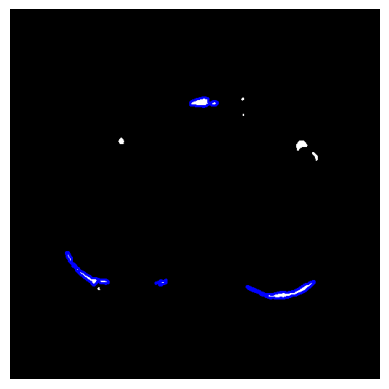
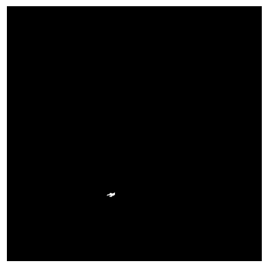
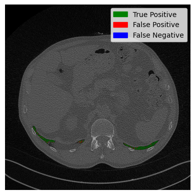

# Lung segmentation in 3D computed tomography scans

Authors: [Frederik Hartmann](https://github.com/Frederik-Hartmann), [Yusuf Baran Tanrıverdi](https://www.github.com/yusuftengriverdi)
\
*Within the scope of the Advanced Image Analysis course taught by [Prof. Alessandro Bria](https://www.unicas.it/didattica/docenti/teacherinfo.aspx?nome_cognome=alessandro_bria). You can reach the full report [here](https://yusuftengriverdi.github.io/blog/2023/04/15/lung_segmentation_3d).*
\
[Erasmus Mundus Joint Master's Degree in Medical Imaging and Application](https://maiamaster.udg.edu/)
\
April 2023

In this tutorial it is explained how to segment a lung in a a 3d CT scan. First let's take a look at a CT scan.

	

In the picture above you can vaguely outline the body, head and arms of the person. Below the person a table, on which the person is lying, can be spotted. It is worth mentioning that the table is not broken and the gaps are due to the displaying technique used. Now lets take a look at a axial slice in the center.

	

In this image the lung is displayed in dark. The surrounding tissues and bones appear brighter. The background is rouhly the same intensity as the lung tissue. In the bottom of the picture multiple lines can be seen. These lines are the edges of the patient table and what appears to be a cushion. The goal of the lung segmentation is to find/segment the lung. In order to do accomplish this the table, background and surrounding tissues need to be removed. The flow diagramm below shows the workflow. In the following all steps will be explained in detail with text, pictures and code.

## Preprocessing
The first step is the preprocessing. The goal is to remove the table and make the background the same intensity as the tissue surrounding the lung. Each pixel/vocel in a computed tomography scan is not encoded in a range from 0-255 (8-bit unsigned), but rather in a range from −32,768 to 32,767 (16-bit signed). However, there is more to it. Each value represents a Hounsfield unit (HU) and Hounsfield units can be attributed to a specific tissue. Because we are only interested in lung tissue, we choose a range in which the lung is safely included and set all other pixels to the maximum of the range. In this case a range of -1000 HU to -500 HU.

<table style="width: 100%;">
  <tr>
    <th style="width: 40%;">Input</th>
    <th style="width: 40%;">Output</th>
    <th style="width: 20%;">Implementation</th>
  </tr>
  <tr>
    <td style="width: 33.33%;"></td>
    <td style="width: 33.33%;">
    <td style="width: 33.33%;">
      <pre lang="python"><code style="font-size: 18px;">
def clipScanToHounsfieldUnitRange(scan,HounsfieldUnitRange):
	HU_min = HounsfieldUnitRange[0]
	HU_max = HounsfieldUnitRange[1]
	return np.clip(scan,a_min=HU_min, a_max=HU_max) 
      </code></pre>
    </td>
  </tr>
</table>

This is done for the entire scan. The steps after this are applied to each slice seperately. It can be seen that the table in this viewing direction is not a straight line. This will become important later. To make the table straight, we use the sagittal view and therefore use sagittal slices. 
1. First we loop through the sagittal slices:
<table style="width: 100%;">
  <tr>
    <th style="width: 50%;">Sagittal slice</th>
    <th style="width: 50%;">Implementation</th>
  </tr>
  <tr>
    <td style="width: 50%;"></td>
    <td style="width: 50%;">
      <pre lang="python"><code>
def createMaskForEachSliceOf(self, clippedScan):
	mask = np.zeros(clippedScan.shape, dtype="int16")
	numberOfSagittalSlices = clippedScan.shape[1]
		for i in range(0,numberOfSagittalSlices):
			sagittalSlice = clippedScan[:,:,i]
			sliceMask = self.createMaskFrom(sagittalSlice)
			mask[:,:,i] = sliceMask.astype("int16")
	return mask
      </code></pre>
    </td>
  </tr>
</table>

2. The next step is to create a mask for each sagittal slice. Each function will be explained used will be explained in the following steps.
<pre lang="python"><code>
def createMaskFrom(self,SagittalSlice):
        denoisedSagittalSlice = cv2.medianBlur(SagittalSlice,ksize=5)
        binarizedSagittalSlice = self.binarize(denoisedSagittalSlice)
        sliceWithOpenTable = self.openTableOf(binarizedSagittalSlice)
        SagittalSliceWithUniformBackground, backgroundMask = self.createUniformBackgroundOf(binarizedSagittalSlice)
        mask = self.createMaskByFillingHolesOf(SagittalSliceWithUniformBackground)
        combinedMask = self.combineMasks(mask, backgroundMask)
        return combinedMask
</code></pre>

3. Let's start with the denoising. It is worth noting that denoising might remove relevant medical information.However, some scans can be a  bit noisy. The type of the noise seems to be "salt" and "pepper" noise. To reduce this kind of noise, one can apply median filtering. Let's zoom in on our slice and apply denoising. To the left you can see the background with some clothes, in the middle the tissues surrounding the lung and on the right the lung. You can see that the noise has been reduced, but at the same time the slice appears to be more blurry.
<table style="width: 100%;">
  <tr>
    <th style="width: 50%;">Clipped Sagittal Slice</th>
    <th style="width: 50%;">Denoised Sagittal Slice</th>
  </tr>
  <tr>
    <td style="width: 50%;"></td>
    <td style="width: 50%;"></td>
  </tr>
</table>

4. In order to create the mask we have to binarize the image. The binarization is achieved by thresholding the image with a threshold of the maximum value minus one.

<table style="width: 100%;">
  <tr>
    <th style="width: 40%;">Input</th>
    <th style="width: 40%;">Output</th>
    <th style="width: 20%;">Implementation</th>
  </tr>
  <tr>
    <td style="width: 33.33%;"></td>
    <td style="width: 33.33%;">
    <td style="width: 33.33%;">
      <pre lang="python"><code> 
def binarize(sagittalSlice):
	_, binarizedSlice = cv2.threshold(sagittalSlice,
	    	thresh=sagittalSlice.max()-1, maxval=1,
	    	type=cv2.THRESH_BINARY)
	return binarizedSlice.astype("uint8")
      </code></pre>
    </td>
  </tr>
</table>

5. Thex next goal is to make everything that is not lung tissue white. In order to accomplish this, we will flood the image from the left and right. We could also flood it from the top and bottom, but in case the lung is touching the border, it will flood it to0. However, a problem remains. When flooding from the right, it is impossible to flow through the table. So we need to break the table first. We do that on the top row of the image only. We use morphological opening to open the table. The structuring element is a line. The line needs to be longer than the table width. The result idea is displayed below.

<table style="width: 100%;">
  <tr>
    <th style="width: 40%;">Input</th>
    <th style="width: 40%;">Output</th>
    <th style="width: 20%;">Implementation</th>
  </tr>
  <tr>
    <td style="width: 33.33%;"></td>
    <td style="width: 33.33%;">
    <td style="width: 33.33%;">
      <pre lang="python"><code> 
def openTableOf(binarizedSagittalSlice):
  kernel = cv2.getStructuringElement(shape=cv2.MORPH_RECT, ksize=(25,1))
  topRowOpen = cv2.morphologyEx(binarizedSagittalSlice[:1], cv2.MORPH_OPEN, kernel, iterations=1)
  binarizedSagittalSlice[:1] = topRowOpen
  return binarizedSagittalSlice)
      </code></pre>
    </td>
  </tr>
</table>

6. Now we floodfill the binarized image from left and right. In addition to that, we will receive a mask of where the floodfilling was applied. We call this mask background mask. The floodfilling only accepts a single pixel as an input. Since we want to flood from the entire edge, we draw a line in the color of background there.
<table style="width: 100%;">
  <tr>
    <th style="width: 40%;">Input</th>
    <th style="width: 40%;">Output</th>
    <th style="width: 20%;">Implementation</th>
  </tr>
  <tr>
    <td style="width: 40%;"></td>
    <td style="width: 40%;">
    <td style="width: 20%;">
      <pre lang="python"><code> 
def createUniformBackgroundOf(binarizedSagittalSlice):
  h, w = binarizedSagittalSlice.shape[:2]
  backgroundMask = np.zeros((h+2,w+2),dtype="uint8")
  cv2.line(binarizedSagittalSlice, (0,0),(0,h-1),0,thickness=1) 
  cv2.line(binarizedSagittalSlice, (w-1,0),(w-1,h-1),0,thickness=1) 
  cv2.floodFill(binarizedSagittalSlice, backgroundMask, (0,0),1,flags=4) 
  cv2.floodFill(binarizedSagittalSlice, backgroundMask, (w-1,0),1,flags=4)
  backgroundMask = np.logical_not(backgroundMask[1:-1,1:-1]).astype("uint8") 
  return binarizedSagittalSlice, backgroundMask
      </code></pre>
    </td>
  </tr>
</table>

7. As you can see we now have the lung in black on a white background. The goal is to have the lung in white on a black background. Because, we will apply the mask to the original image again and refine it, we can close the holes now generously. This is done by applying a box filter of ones with a kernel size of 30. The output of this convolution will not be binary anymore. Therefore, the slice is thresholded again. As you can see the lung area is covered, but there are some points that clearly don't below to the lung.

<table style="width: 100%;">
  <tr>
    <th style="width: 50%;">Output</th>
    <th style="width: 50%;">Implementation</th>
  </tr>
  <tr>
    <td style="width: 50%;">
    <td style="width: 50%;">
      <pre lang="python"><code> 
def createMaskByFillingHolesOf(BinarySliceWithUniformBackground):
  inverted = (np.logical_not(BinarySliceWithUniformBackground)).astype("uint8")
  filled = cv2.boxFilter(inverted, ddepth=-1, ksize=(30,30), normalize=False)
  _, binarized = cv2.threshold(filled, thresh=1, maxval=1, type=cv2.THRESH_BINARY)
  return binarized
      </code></pre>
    </td>
  </tr>
</table>

8. The final step of the preprocessing is the combining of the masks. The creation of the mask in step 7. has caused the mask to grow back in the background. Luckily for us,  in step 6, we have created a background mask so we can just use this one. In the image below, one difference is circled.

<table style="width: 100%;">
  <tr>
    <th style="width: 50%;">Output</th>
    <th style="width: 50%;">Implementation</th>
  </tr>
  <tr>
    <td style="width: 50%;">
    <td style="width: 50%;">
      <pre lang="python"><code> 
def combineMasks(filledMask, backgroundMask):
  return cv2.bitwise_and(filledMask, backgroundMask)
      </code></pre>
    </td>
  </tr>
</table>

Now let's put everything together. First we clip the scan, than we create a mask slice-by-slice by applying the eight steps:

<pre lang="python"><code> 
def createCoarseLungMaskOf(self,scan):
  HounsfieldUnitRange = (-1000, -500)
  clippedScan = self.clipScanToHounsfieldUnitRange(scan, HounsfieldUnitRange)
  mask = self.createMaskForEachSliceOf(clippedScan)
  return mask
</code></pre>

As a reminder: The returned mask is a 3d numpy array. Additionally, all functions have been put in a class.

### Evaluation of preprocessing
The goals of the preprocessing were:
1. Remove the table
2. Make the backgroud and surrounding tissue of the lung the same color
   
Let's check if the table is removed:

	

It can be seen that the table was sucessfully removed. However, some artifacts remain (circled in red). Additionally, the tube in the middle (circled in blue) is not a part of the lung, but it is part of the airways to provide the lung with air. The tube is called trachea. We will take care of these problems in the next step, but for now let's have a look at the background. It can be seen seen that the background seems to be the same color, but did we remove any lung pixels/voxels? For that we calculate the sensitivity on the vessel12 dataset:

	0.9999694 &pm; 0.0000436

It can be seen that some pixels are wrongly labeled as not lung. Nevertheless, the amount of wrongly labeled pixels is low. Additionally, the region of interest has been reduced from the entire image to a smaller mask. The average relative size is

	&sum; Predicted Mask / 	&sum; Actual Mask = 0.1864

This means that the predicted mask is roughly 81% smaller than the original image. 

## Lung Segmentation
In the preprocessing step we have managed to get a relatively coarse lung mask. Let's refine this mask. The two main goals are:
1. Remove the artifacts
2. Remove the tracha and aerial ways

### Loading the scan
Before we get into that. There is one thing we haven't talked about yet and that is loading the scan. Now this step depends on the dataformat you are using. If you are using Vessel12, the file ending is **".mhd"**. We can load this file format using simpleITK. It is worth noting that simpleITK supports a variety of file formats, so just try yours. The ".mhd" file contains meta data and the scan:

<pre lang="python"><code> 
def readScanMetaFrom(scanPath):
  return sitk.ReadImage(scanPath)
</code></pre>

To get the actual scan without meta data we can use the following:

<pre lang="python"><code> 
def readScanMetaFrom(scanPath):
  return sitk.ReadImage(scanPath)
</code></pre>

Now we are good to go. So lets dive right into it.

1. First, we use preprocessing and apply mask the scan:

<pre lang="python"><code> 
coarseMask = self.preprocessing.createCoarseLungMaskOf(self.scan)
coarseScan = coarseMask*self.scan
</code></pre>

</code></pre>

 
<table style="width: 100%;">
  <tr>
    <th style="width: 50%;">Preprocessing Mask</th>
    <th style="width: 50%;">Preprocessing Mask * Scan</th>
  </tr>
  <tr>
    <td style="width: 50%;"></td>
    <td style="width: 50%;"></td>
  </tr>
</table>  

2. Remember we want to refine the mask right. So Let's create a function for that. The idea is the following: We clip the slice again, search for contours and decide if these contours are lung or not. We will do this by tracking the contours, but more on that later. The process of deciding if a contour is lung or not is included in the *createFineMaskFrom(...)* function.

<pre lang="python"><code> 
def refine(self, coarseScan):
  HounsfieldUnitRange = (-1000, -500)
  clippedScan = self.preprocessing.clipScanToHounsfieldUnitRange(coarseScan, HounsfieldUnitRange)
  contoursForEachAxialSlice = self.findContoursForEachAxialSliceOf(clippedScan)
  fineMask = self.createFineMaskFrom(contoursForEachAxialSlice)
  return fineMask
</code></pre>

 

### Finding Contours
We have covered the clipping in the preprocessing, so the next step is finding the contours. We will search for the contours in the axial slices.

1. Loop through the axial slices:

<pre lang="python"><code> 
def findContoursForEachAxialSliceOf(self, clippedScan):
  numberOfAxialSlices = clippedScan.shape[0]
  contoursForEachAxialSlice = [None] * numberOfAxialSlices
  for i in range(0, numberOfAxialSlices):
      axialSlice = clippedScan[i]
      sliceContours = self.findContoursOf(axialSlice)
      contoursForEachAxialSlice[i] = sliceContours
  return contoursForEachAxialSlice
</code></pre>

 

2. The second step is to find the contours for each axial slice. We will use openCV's findContours for this. Let's take a look what the [documentation](https://docs.opencv.org/4.7.0/d3/dc0/group__imgproc__shape.html#gadf1ad6a0b82947fa1fe3c3d497f260e0) is saying about the input image:  
  *Source, an 8-bit single-channel image. Non-zero pixels are treated as 1's. Zero pixels remain 0's, so the image is treated as **binary**.*  
This is important. The input image will be "converted" to binary. Why not make it binary in the way we want it. Another important thing is not explicitely written: The background is expected to be black and the foreground to be white. Our background is white and the foregroud - the lung - is black. This will cause *findContours* to find a contour around the entire image. We don't want that. Summing up, we have three things to consider:  
    - The slice shold be binary
    - The background should be black and the foreground white
    - The slice should be 8-bit
 
    We will deal with the first two together. First, we denoise the image and than we threshold the image. This time we use *THRESH_BINARY_INV* to invert the colors. The Lung is now white and the background black. After that we convert the binary image to 8-bit. Let's take a look at the code and the output image.
		
<table style="width: 100%;">
  <tr>
    <th style="width: 50%;">Output</th>
    <th style="width: 50%;">Implementation</th>
  </tr>
  <tr>
    <td style="width: 50%;">
    <td style="width: 50%;">
      <pre lang="python"><code> 
def prepare(self, axialSlice):
	denoisedAxialSlice = cv2.medianBlur(axialSlice, ksize=5)
	binarizedAxialSlice = self.binarize(denoisedAxialSlice)
	return binarizedAxialSlice

@staticmethod
def binarize(axialSlice):
	_, binarizedSlice = cv2.threshold(axialSlice, thresh=axialSlice.max()-1,
					maxval=1, type=cv2.THRESH_BINARY_INV)
  	return binarizedSlice.astype("uint8")
      </code></pre>
    </td>
  </tr>
</table>

3. Now that we have prepared our slice it is time to find the contours. But how many lung contours can realistically be in a axial slice? You might think two lungs = two contours. However, this is only the case in three-dimensions. The maximum number of lung contours is empirically chosen to be four. We will first look at the code and than at two examples of the contours. Additionally, we use *RETR_EXTERNAL* to retrieve only the outer contours.

<pre lang="python"><code> 
def findContoursOf(self, axialSlice):
  preparedSlice = self.prepare(axialSlice)
  contours,_ = cv2.findContours(preparedSlice, mode=cv2.RETR_EXTERNAL, method=cv2.CHAIN_APPROX_NONE)
  contoursSortedByLength = sorted(contours, key=lambda contour:len(contour), reverse=True)
  reducedNumberOfContours = self.reduceNumberOf(contoursSortedByLength)
  return reducedNumberOfContours

def reduceNumberOf(self, contoursSortedByLength):
  if len(contoursSortedByLength) > self.MAX_NUMBER_OF_CONTOURS_TO_BE_TRACKED:
      return contoursSortedByLength[:self.MAX_NUMBER_OF_CONTOURS_TO_BE_TRACKED]
  else:
      return contoursSortedByLength
</code></pre>

 
<table style="width: 100%;">
  <tr>
    <th style="width: 50%;">Two Contours</th>
    <th style="width: 50%;">More Contours</th>
  </tr>
  <tr>
    <td style="width: 50%;"></td>
    <td style="width: 50%;"></td>
  </tr>
</table>  
We will take a look at how many contours are correct in the right example later on.

### Tracking the Contours
We now have a bunch of contours, but which ones are actually lung contours? Which ones are artifacts? Which ones are trachea? For this we will track the contours. We start in the center slice and assume all contours there are lung contours.We now go one slice up and compare the contours, if they are more or less the same: it is a lung contour too! We now go on slice up again and compare the contours to the ones in the slice below and so on. We will do exactly the same for the center to the bottom, it is just reversed. Let's get into it.

1. First we create one maks for the top half of the 3d image and one for the bottom half:  

<pre lang="python"><code> 
def createFineMaskFrom(self, contoursForEachAxialSlice):
  refinedBottomMask = self.refineMaskBytrackingLungContours(contoursForEachAxialSlice, direction="centerToTop")
  refinedTopMask = self.refineMaskBytrackingLungContours(contoursForEachAxialSlice, direction="centerToBottom")
  refinedMask = self.addMasks(refinedBottomMask,refinedTopMask)
  return refinedMask
</code></pre>

 

1. Now we cycle through each axial slice contour by contour and compare it to the counters of the previous slice. Don't worry too much about the code at the top. The important steps are happening in the for loop. For a closer look at the top functions,refer to this [file](lungSegmentation.py).

<pre lang="python"><code> 
def refineMaskBytrackingLungContours(self, contoursForEachAxialSlice, direction):
  startIndex = self.getStartIndex(contoursForEachAxialSlice, direction)
  finalIndex = self.getFinalIndex(contoursForEachAxialSlice, direction)
  stepDirection = self.stepDirectionToInteger(direction)
  refinedMask = np.zeros(self.scanDimensions)
  centerContours = contoursForEachAxialSlice[startIndex]
  previousMasks = self.getCandidateMasksFrom(centerContours)
  for i in range(startIndex, finalIndex, stepDirection):
	CurrentContours = contoursForEachAxialSlice[i]
	lungMasks = self.comparePreviousMasksToCurrentContours(previousMasks,CurrentContours)
	lungMask = self.createSingleMaskFrom(lungMasks)
	refinedMask[i] = lungMask
	previousMasks = lungMasks
  return refinedMask
</code></pre>

2. For the comparison we will need a mask rather than a contour. *getCandidateMasksFrom* is doing just that. We will have a look at it next - also with pictures. After that we compare every current mask to the masks from the previous slice. Once we have found a match, we assume it is a lung mask. We not quit the search for this current mask and continue with next one. If no match is found, we assume it is not lung. We will also have a close look at *isLungMask* and how we decide if its a lung mask or not, but first we look at *getCandidateMasksFrom*.

<pre lang="python"><code> 
def comparePreviousMasksToCurrentContours(self, previousMasks,CurrentContours):
  candidateMasks = self.getCandidateMasksFrom(CurrentContours)
  lungMasks = [
  for mask in candidateMasks:
    for prevMask in previousMasks:
      if self.isLungMask(mask, prevMask):
        lungMasks.append(mask)
        break # breaks inner loop
  
  return lungMasks
</code></pre>

 

3. Let us quickly have a look at the code before we look at some pictures. The idea is simple: We create one mask for each contour:

<pre lang="python"><code> 
def getCandidateMasksFrom(self, CurrentContours):
  numberOfContours = len(CurrentContours)
  candidateMasks = [None] * numberOfContours
  sliceDimensions = self.scanDimensions[1:3]
  for i in range(0,numberOfContours):
    candidateMask = np.zeros(sliceDimensions, dtype="uint8")
    cv2.drawContours(candidateMask, [CurrentContours[i]], contourIdx=-1, color=1, thickness=cv2.FILLED)
    candidateMasks[i] = candidateMask
  return candidateMasks
</code></pre>

 
And finally some pictures:
<table style="width: 100%;">
  <tr><th colspan="3">Two contours</th></tr>
  <tr>
    <th style="width: 33.33%;">All Contours</th>
    <th style="width: 33.33%;">Mask for contour 1</th>
    <th style="width: 33.33%;">Mask for contour 2</th>
  </tr>
  <tr>
    <td style="width: 33.33%;"></td>
    <td style="width: 33.33%;">
    <td style="width: 33.33%;">
  </tr>
</table>
And even more. Rember, we chose the maximum number of contours at four. The tradeoff here is runtime vs accuracy. The more contours the higher the runtime, the higher the accuracy.
<table style="width: 100%;">
  <tr><th colspan="5">More contours</th></tr>
  <tr>
    <th style="width: 20%;">All Contours</th>
    <th style="width: 20%;">Mask for contour 1</th>
    <th style="width: 20%;">Mask for contour 2</th>
    <th style="width: 20%;">Mask for contour 3</th>
    <th style="width: 20%;">Mask for contour 4</th>

  </tr>
  <tr>
    <td style="width: 20%;"></td>
    <td style="width: 20%;">
    <td style="width: 20%;">
    <td style="width: 20%;">
    <td style="width: 20%;">
  </tr>
</table>

1. For the comparison, we look at the two jaccard score. It accounts for the overlap (intersection) and the union of the current mask and the previus mask. Instead of the combination, the difference is displayed for visualization purposes.
<table style="width: 100%;">
  <tr><th colspan="2">Two contours</th></tr>
  <tr>
    <th style="width: 50%;">Comparison contour 1</th>
    <th style="width: 50%;">Comparison contour 2</th>
  </tr>
  <tr>
    <td style="width: 50%;"></td>
    <td style="width: 50%;">
  </tr>
</table>
<table style="width: 100%;">
  <tr><th colspan="4">More contours</th></tr>
  <tr>
    <th style="width: 25%;">Comparison contour 1</th>
    <th style="width: 25%;">Comparison contour 2</th>
    <th style="width: 25%;">Comparison contour 3</th>
    <th style="width: 25%;">Comparison contour 4</th>

  </tr>
  <tr>
    <td style="width: 25%;"></td>
    <td style="width: 25%;">
    <td style="width: 25%;">
    <td style="width: 25%;">

  </tr>
</table>
You can see that all comparisons look relatively good. Sure, some differences are a bit bigger and some are a bit smaller, but nonetheless, the difference doesn't seem that big. So are all of the masks displayed here a lung contour? The answer is surpringly no, because each contour has to be **continuously** tracked from the center slice. In the next steps we will take a look at the decision making and the results of the tracking.

5. For the decision making, three cases are considered:
   1. **Normal case**: The contour got slightly bigger or smaller
   2. **Splitting case**: One Contour split into two contours
   3. **Merging  case**: Two contours merged into on contour
  Let's put that into code:

<pre lang="python"><code> 
def isLungMask(self,mask, prevMask):
  jaccardScore = self.computeJaccardScore(mask, prevMask)
  currentSize = cv2.countNonZero(mask)
  prevSize = cv2.countNonZero(prevMask)
  if self.isMaskOverlapping(jaccardScore):
	return True
  elif self.isMaskSplittedIntoTwoMasks(jaccardScorecurrentSize, prevSize):
	return True
  elif self.isMaskMergedFromTwoMasks(jaccardScorecurrentSize, prevSize):
	return True
  else:
	return False
</code></pre>

 

6. Now we need to define each case. But before we do that let's look at the jaccard score:

	jaccard score = intersection / 	union 

We can comput the intersection with using and **AND** Gate, the union using an **OR** Gate;

<pre lang="python"><code> 
def computeJaccardScore(mask, prevMask):
  intersection = cv2.countNonZero(cv2.bitwise_and(mask,prevMask))
  union = cv2.countNonZero(cv2.bitwise_or(mask,prevMask))
  if union != 0:
    return intersection/union
  else:
    return 1.0
</code></pre>

 

7. Now we can define the each case. In the first case: If the jaccard score is bigger than the threshold - which has been set to 0.1 - we assume its a lung mask.

<pre lang="python"><code> 
def isMaskOverlapping(self, jaccardScore):
  if jaccardScore > self.JACCARD_THRESHOLD:
    return True
  else:
    return False
</code></pre>

8. The second case can happen if the two lungs are detected as one contour and than detected in two contours in the next slice. In this case we assume that the contour is now roughly half as big. The merging is the practically the same, but in reverse: Two masks merged into one.   

<pre lang="python"><code> 
def isMaskSplittedIntoTwoMasks(self, jaccardScore, currentSize, prevSize):
  if jaccardScore > self.JACCARD_THRESHOLD/3 and np.isclose(2*currentSize, prevSize, rtol=0.3):
    return True
  else:
    return False
</code></pre>

   

<pre lang="python"><code> 
def isMaskMergedFromTwoMasks(self, jaccardScore, currentSize, prevSize):
  if jaccardScore > self.JACCARD_THRESHOLD/3 and np.isclose(currentSize, 2*prevSize, rtol=0.3):
    return True
  else:
    return False
</code></pre>

This us an  image of an actual splitting case. It is worth noting that the merging case would look the same, because we are only displaying the difference and not which slice is the current and previous one. You can see that the lung in the previous slice was one cotour. Now there are two.

	

### A small Evaluation
Remember the picture with a lot of contours? No? No problem. Here it is again:

	

Can you guess which ones are lung contours? Let's take a look at what our tracking predicts:

	

Our tracking precits the three at the bottom to be lung contours. But is that correct? At the time of writing I don't actually know the answer. Let's compare it to the Ground Truth to find out. 

	

The green part is where our prediction is correct, the red part where its missing pixels. All in all our tracking was correct and identified the three contours correctly. Some pixels are missing, but not too bad. Good stuff.

## Postprocessing
The Final step is the posprocessing. For this morphological operations in the form of closing is performed.

1. First we loop through the axial slices

<pre lang="python"><code> 
  def closeHolesForEachAxialSlice(self, mask):
    closedMask = np.zeros(mask.shape, dtype="uint8")
    numberOfAxialSlices = mask.shape[0]
    for i in range(0, numberOfAxialSlices):
      closedSlice = self.closeHolesForEachCompoment(mask[i])
      closedMask[i] = closedSlice 
    return closedMask
</code></pre>

2. The Closing is perfomed for each contour/compoment seperately. This will avoid them growing together:

<pre lang="python"><code> 
def closeHolesForEachCompoment(self, axialSlice):
  mask = np.zeros(axialSlice.shape, dtype="uint8")
  numberOfLabels, labelImage = cv2.connectedComponents(axialSlice)
  for label in range(1, numberOfLabels):
    componentImage = np.array(labelImage == label, dtype="uint8")
    closedSlice = self.closeComponent(componentImage)
    mask += closedSlice
  return mask    
</code></pre>

3. And finally the closing:

<pre lang="python"><code> 
def closeComponent(componentImage):
  kernel = cv2.getStructuringElement(shape=cv2.MORPH_RECT, ksize=(15,15))  
  return cv2.morphologyEx(componentImage, cv2.MORPH_CLOSE, kernel)
</code></pre>

In the figure below the closing is perfomed for each component separately and for all componets together. You can see that the lung is incorreclty connected at the top when no sperate componets are used.
<table style="width: 100%;">
  <tr>
    <th style="width: 50%;">Separate Components</th>
    <th style="width: 50%;">No Components</th>
  </tr>
  <tr>
    <td style="width: 50%;"></td>
    <td style="width: 50%;"></td>
  </tr>
</table>  
   
## Evaluation
We have now assembled a lung segmentation. Remember the image we started with? You could still see the person. We reduced our region of interest in the preprocessing and found a lung, but there were artifacts and the trachea (the tube looking thing) was still clearly visible. Let's see if the changes we made were successfull:

	

You can see that the artifacts were sucessfully removed and the trachea is no longer visible. Let us now take a look at axial slices. We will look at a good performing example and the worst performing example I could find.
<table style="width: 100%;">
  <tr>
    <th style="width: 50%;">Good Case</th>
    <th style="width: 50%;">Worst Case</th>
  </tr>
  <tr>
    <td style="width: 50%;"></td>
    <td style="width: 50%;"></td>
  </tr>
</table>
The slice on the left side shows an almost perfect segmentation. The overlap of the predicted lung and the actual lung is displayed in green. The two black dots and the middle are the trachea and aerial ways. The were predicted by our algorithm to not be lung. Which is correct. On right side the worst case is displayed. A large part of the trachea is wrongly classified as lung. Now let's have a look on our image with two contours and see how it did:

	

The right lung is mostly classified correctly. Only two small areas of the trachea are wrongly classified. However, on the left side it can be seen that the trachea was not removed, despite the fact that it is not connected to the lung. The solution to this problem could be retracking the lung from the bottom to the top as the trachea has been correctly removed in the outer parts which can be seen in the 3d scan or the small evaluation in the preprocessing. 

### Metrics
Okay we have seen a lot of slices and scans. Let us put it into number now. We will use the jaccard score as a metric and evaluate it on the Vessel12 dataset. It is worth noting that the Vessel12 dataset is not specifically made for lung segmentation, but rather for vessel segmentation. So the results are only to provide an idea of the perfomance of the algoithm. The dataset consists of twenty ct scans. Let's see the results:

	jaccard score = 0.9779 &pm; 0.0103

That doesn't look to bad!

## Limitations
Now we will recap the assumptions we made that ensure the basic functioning and than we will discuss the problems of the algorithm. In total three assumptions were made:
- The width in pixels of the table is lower than 25 pixels.
- The lung is surrounded by other tissues from the left and the right in sagittal slices
- All contours in the center slice are lung

If the first two conditions are not met, the algorithm will output "randomly". If the third condition is not met, it will perform worse. A possible lifting of the first condition is the introduction of a width relative to the size of the scan. The third contition could potentially be removed by retracking the lung as explained above.

The current algorithm has two problems:
1. The thachea in the center slices is not perfectly removed in some scenarios
2. The contours do not precisely follow the lung contours if for example a vessel is at the edge for the lung
   
The origin of the first problem is the third assumption. Hence, it has the same possible solution. The second problem arises from the usage of contours to create the mask rather than from the image "directly". Kmeans has been employed to resample the image. Another less computationaly heavy approach is simply the preparation step of the preprocessing - clipping and thresholding. In abscence of an perfect ground truth this approaches have been implemented, but could not be evaluated. Therefore, you will not find them in this repository. 

## Conclusion
All in all, a algorithm for lung segmentation has been sucessfully implemented. Nevertheless, there is still room for improvement as described above. I hope you could take something away from this tutorial and **have a great day!**

